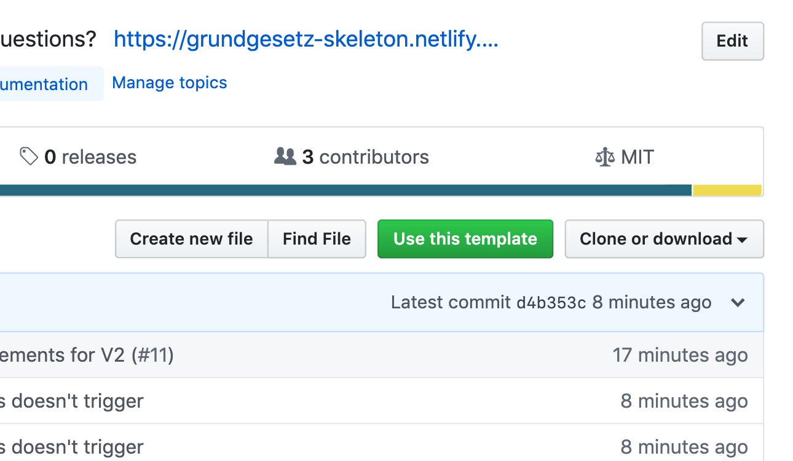
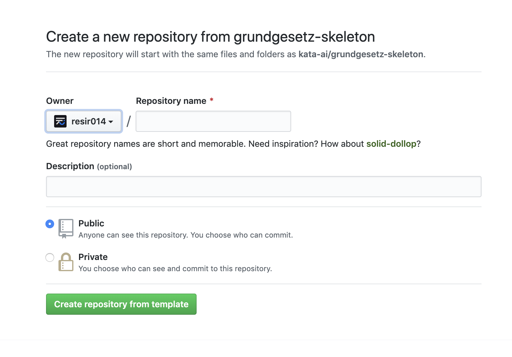

# grundgesetz-skeleton

> You have a documentation. I turn it into a website. Any questions?

Welcome to Grundgesetz. It's a skeleton for generating accessible documentation pages built on top of [Gatsby](https://www.gatsbyjs.org). It creates static pages from your Markdown documentation files, all prettily formatted with a easy-to-use layout.

Grundgesetz is initially built to solve internal issues in managing documentation for our products at [Kata.ai](https://kata.ai/), but at the same we also found out that it's a good base for quickly deploying a documentation site online, so we put this up for everyone to use.

## What's with the name?

It's German for "constitution". We had a thing for German codenames here at Kata.ai.

## Who's using it?

- [Kata Platform Documentation](https://docs.kata.ai/)
- [TinaCMS](https://tinacms.org/docs/getting-started/introduction)
- [Accelero](https://docs.accelero.io/)

## Core Concepts

### Just Your Docs

Grundgesetz is set up for you to get up and running straight away. We know that writing proper documentation often takes a long time, so we aim to create this tool to standardise your documentation format.

All your docs are written in the familiar Markdown format and go inside the `/docs` folder. You can customise the table of contents and the header menu through a JSON file. It will generate pages with path names based on the directory tree, but you can override it anytime by setting a `permalink` frontmatter.

### Instantly Deployable

Since Grundgesetz is a static site generator, you can instantly deploy to any static web host.

Have an instance of Grundgesetz set up on GitHub? You can easily deploy it using the built-in `deploy` task. You can also set up a continuous deployment pipeline for hosting providers like [Netlify](https://www.netlify.com/) or [ZEIT Now](https://zeit.co/now).

### Blazing Fast

Grundgesetz is built on top of Gatsby, a blazing-fast static site generator for React. Also, putting the words "blazing fast" into any project's README seems to attract a lot of folks lately. So I put it in here. Sorry.

Want to learn more about Gatsby? [Click here](https://www.gatsbyjs.org).

---

## Geting Started

### Prerequisites

- [Node.js](https://nodejs.org/en/) (8.0.0+)
- [Yarn](https://yarnpkg.com) (Optional. You can still use `npm` if you want, but this is for your own sanity.)

### Initializing the Project

#### The Fast Way

You can now create a new repository with Grundgesetz included by going to the GitHub page clicking on the "Use this template" button on the top right.



This will take you to the Create Repository screen. Fill in the details of your projects, and click "Create repository from template".



Once the repository is created, you can [clone the repository](https://help.github.com/en/articles/cloning-a-repository) and open your terminal in the repository's folder. Once you're there, install the dependencies by running `yarn` (or `npm install`, if you prefer to use npm).

#### Using Gatsby CLI

Alternatively, you can bootstrap your project using `gatsby-cli`. To install it, run the following command.

```bash
# npm
npm install -g gatsby-cli
# yarn
yarn global add gatsby-cli
```

Now we have `gatsby-cli` installed, we can now create a project based on the Grundgesetz skeleton by running:

```bash
gatsby new project-name https://github.com/kata-ai/grundgesetz-skeleton
```

The project is generated in the folder with the `project-name` you specified. In the next section, we will start writing our documentation on-the-fly with the development server.

### Running the server

Now that we have the project set up, let's `cd` to the generated project. Here we'll have to install our node dependencies. To do so, run the following command.

```bash
# npm
npm install
# yarn
yarn
```

To start working on our documentation, we need to start a development server.

```bash
# npm
npm dev
# yarn
yarn dev
```

The command above will start a development server with hot-reloading capabilities on `localhost:8000`. From now on, you can start writing your documentation with ease.

Read the [docs](https://grundgesetz-skeleton.netlify.com/getting-started/deploying) for tips on how to deploy your new docs website to production.

## Credits

Built with [Gatsby](https://www.gatsbyjs.org/) - the blazing-fast static site generator for [React](https://facebook.github.io/react/).

## Authors

- Resi Respati ([@resir014](https://twitter.com/resir014)) – [Kata.ai](https://kata.ai)
